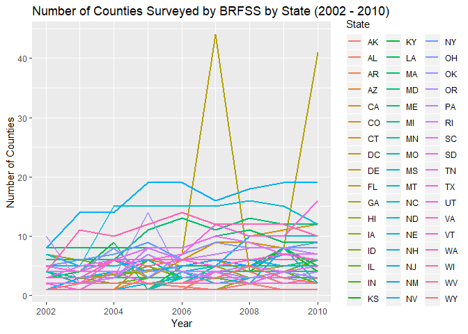

p8105\_hw3\_rt2712
================
Rachel Tsong
15 October 2018

Problem 1
=========

Step 1
------

Load and clean up the BRFSS data

``` r
library(tidyverse)
```

    ## -- Attaching packages ---------------------------------------------------------------------------- tidyverse 1.2.1 --

    ## v ggplot2 3.0.0     v purrr   0.2.5
    ## v tibble  1.4.2     v dplyr   0.7.6
    ## v tidyr   0.8.1     v stringr 1.3.1
    ## v readr   1.1.1     v forcats 0.3.0

    ## -- Conflicts ------------------------------------------------------------------------------- tidyverse_conflicts() --
    ## x dplyr::filter() masks stats::filter()
    ## x dplyr::lag()    masks stats::lag()

``` r
library(p8105.datasets)

data(brfss_smart2010)

brfss_data = brfss_smart2010 %>%
  janitor::clean_names() %>%
  filter(topic == "Overall Health") %>%
  rename(state = locationabbr, county = locationdesc, proportion_responses = data_value) %>%
  select(year:county, response, proportion_responses) %>%
  mutate(response = factor(response, levels = c("Poor", "Fair", "Good", "Very good", "Excellent")))
```

Step 2
------

Answer questions

**In 2002, which states were observed at 7 locations?**

``` r
brfss_data %>%
  filter(year == 2002) %>%
  distinct(county, .keep_all = TRUE) %>%
  group_by(state) %>%
  summarize(n = n()) %>%
  filter(n == 7)%>%
  as_tibble()
```

    ## # A tibble: 3 x 2
    ##   state     n
    ##   <chr> <int>
    ## 1 CT        7
    ## 2 FL        7
    ## 3 NC        7

In 2002, there were 3 states that were observed at exactly 7 locations (Connecticut, Florida, and North Carolina).

**“Spaghetti plot” showing the number of locations in each state from 2002 to 2010**

``` r
library(ggplot2)

brfss_data %>%
  group_by(year, state) %>%
  summarize(n_counties = n_distinct(county)) %>%
  ggplot(aes(x = year, y = n_counties, color = state)) + 
  labs(x = "Year", y = "Number of Counties", color = "State") +
  geom_line(size = 1)
```



The spaghetti plot above shows the number of different counties that were surveyed by the BRFSS from 2002 to 2010 in each state. Since all 50 states and DC are representd in the data set, it is hard to distinguish between the different states in the plot by color. However, there isn't really a better way to distinguish between the states, so while the figure looks pretty nice, it is not necessarily a good figure to draw conclusions from.

**Table showing mean and standard deviation of the proportion of “Excellent” responses across locations in NY State (2002, 2006, and 2010)**

``` r
brfss_data %>%
  filter(state == "NY", response == "Excellent", year == 2002 | year == 2006 | year == 2010) %>%
  group_by(year) %>%
  summarize(mean_excellent = mean(proportion_responses), sd_excellent = sd(proportion_responses)) %>%
  knitr::kable()
```

|  year|  mean\_excellent|  sd\_excellent|
|-----:|----------------:|--------------:|
|  2002|         24.04000|       4.486424|
|  2006|         22.53333|       4.000833|
|  2010|         22.70000|       3.567212|
