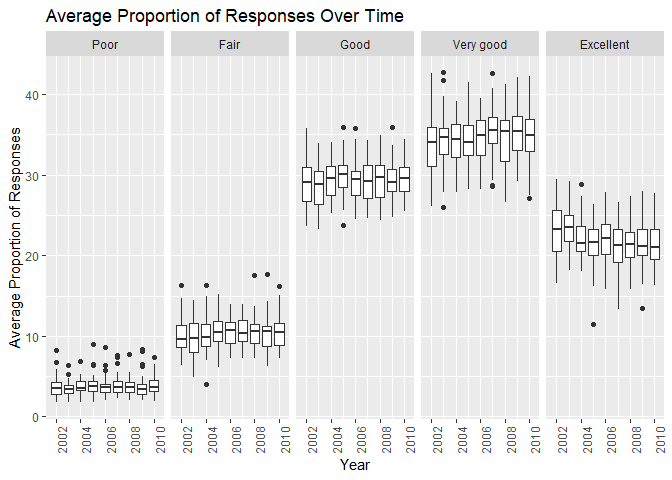
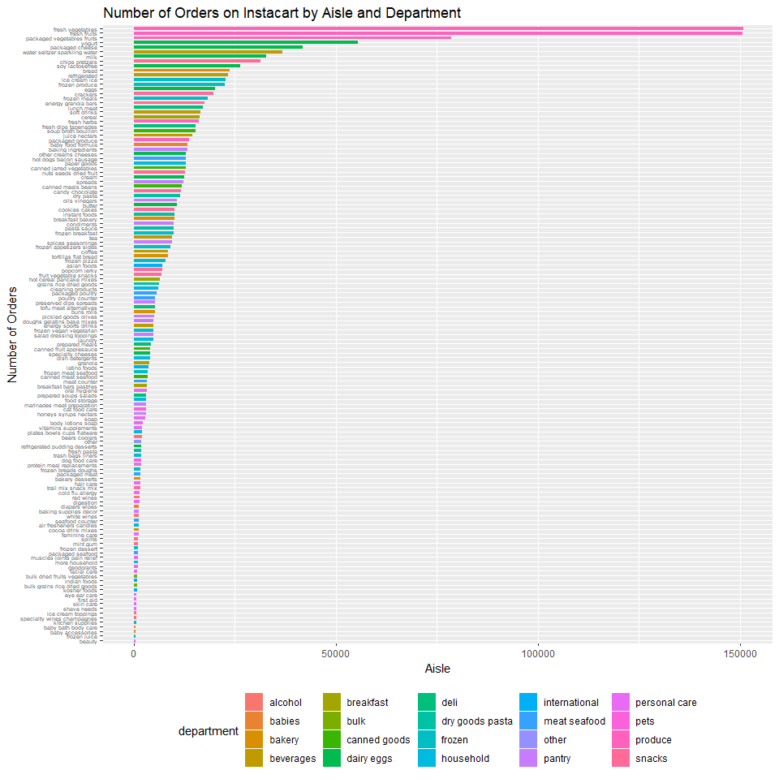

p8105\_hw3\_rt2712
================
Rachel Tsong
15 October 2018

Problem 1
=========

Step 1
------

Load and clean up the BRFSS data

``` r
library(tidyverse)
```

    ## -- Attaching packages ---------------------------------------------------------------------------- tidyverse 1.2.1 --

    ## v ggplot2 3.0.0     v purrr   0.2.5
    ## v tibble  1.4.2     v dplyr   0.7.6
    ## v tidyr   0.8.1     v stringr 1.3.1
    ## v readr   1.1.1     v forcats 0.3.0

    ## -- Conflicts ------------------------------------------------------------------------------- tidyverse_conflicts() --
    ## x dplyr::filter() masks stats::filter()
    ## x dplyr::lag()    masks stats::lag()

``` r
library(p8105.datasets)

data(brfss_smart2010)

brfss_data = brfss_smart2010 %>%
  janitor::clean_names() %>%
  filter(topic == "Overall Health") %>%
  rename(state = locationabbr, county = locationdesc, proportion_responses = data_value) %>%
  select(year:county, response, proportion_responses) %>%
  mutate(response = factor(response, levels = c("Poor", "Fair", "Good", "Very good", "Excellent")))
```

Step 2
------

Answer questions

**In 2002, which states were observed at 7 locations?**

``` r
brfss_data %>%
  filter(year == 2002) %>%
  distinct(county, .keep_all = TRUE) %>%
  group_by(state) %>%
  summarize(n = n()) %>%
  filter(n == 7)%>%
  as_tibble()
```

    ## # A tibble: 3 x 2
    ##   state     n
    ##   <chr> <int>
    ## 1 CT        7
    ## 2 FL        7
    ## 3 NC        7

In 2002, there were 3 states that were observed at exactly 7 locations (Connecticut, Florida, and North Carolina).

**“Spaghetti plot” showing the number of locations in each state from 2002 to 2010**

``` r
library(ggplot2)

brfss_data %>%
  group_by(year, state) %>%
  summarize(n_counties = n_distinct(county)) %>%
  ggplot(aes(x = year, y = n_counties, color = state)) + 
  labs(x = "Year", y = "Number of Counties", color = "State") +
  geom_line(size = 1)
```


The spaghetti plot above shows the number of different counties that were surveyed by the BRFSS from 2002 to 2010 in each state. Since all 50 states and DC are representd in the data set, it is hard to distinguish between the different states in the plot by color. However, there isn't really a better way to distinguish between the states, so while the figure looks pretty nice, it is not necessarily a good figure to draw conclusions from.

**Mean and standard deviation of the proportion of “Excellent” responses across locations in NY State (2002, 2006, and 2010)**

``` r
brfss_data %>%
  filter(state == "NY", response == "Excellent", year == 2002 | year == 2006 | year == 2010) %>%
  group_by(year) %>%
  summarize(mean_excellent = mean(proportion_responses), sd_excellent = sd(proportion_responses)) %>%
  knitr::kable()
```

|  year|  mean\_excellent|  sd\_excellent|
|-----:|----------------:|--------------:|
|  2002|         24.04000|       4.486424|
|  2006|         22.53333|       4.000833|
|  2010|         22.70000|       3.567212|

From the summary table above, it appears as if the mean number of respondents who consider themselves to be in "Excellent" health was about the same in 2002, 2006, and 2010 (about 22-24% of respondents). Looking at the standard deviations, it appears as if there was the highest variation in the proportion of excellent responses by county in NY in 2002 and the lowest variation in 2010.

**Five-panel plot showing the distribution of state-level averages over time for each response category**

``` r
brfss_data %>%
  group_by(year, state, response) %>%
  summarize(mean = mean(proportion_responses)) %>% 
  ggplot(aes(x = year, y = mean)) + 
    geom_point() + 
    facet_grid(~response) +
    labs(x = "Year", y = "Average Proportion of Responses", title = "Average Proportion of Responses Over Time") +
    theme(axis.text.x = element_text(angle = 90))
```

    ## Warning: Removed 21 rows containing missing values (geom_point).



In this 5 panel plot, we can see how the proportion of responses for each state varies across time. Also, since we plot of a point for each state, we can get an idea of how varied the data are for within each category.

Problem 2
=========

Step 1
------

``` r
data("instacart")
```

**Dataset description**
This dataset contains information about customer orders from Instacart, a grocery delivery company. First, there is some information about the customer including the customer ID, days since last Instacart order, number of times they've ordered from Instacart, and the time the customer placed the order. Additionally, there is information about the contents of the order including the product name and where the product can be found in the store (department and aisle). For example, the product "Bulgarian yogurt" is identified by a numerical product ID, and it is in the "yogurt" aisle in the "dairy & eggs" department. The aisle and deparment is also identified by a numerical ID. There are 1,384,617 observations of 15 variables.

Step 2
------

Answer questions

**How many aisles are there, and which aisles are the most items ordered from**

``` r
instacart %>% 
  group_by(aisle) %>%
  summarize(n = n()) %>%
  arrange(-n) %>%
  head() %>%
  knitr::kable()
```

| aisle                         |       n|
|:------------------------------|-------:|
| fresh vegetables              |  150609|
| fresh fruits                  |  150473|
| packaged vegetables fruits    |   78493|
| yogurt                        |   55240|
| packaged cheese               |   41699|
| water seltzer sparkling water |   36617|

There are 134 aisles, and the most ordered from aisles are shown in the table above.

**Plot that shows the number of items ordered in each aisle. Order aisles sensibly, and organize your plot so others can read it**

``` r
plot = instacart %>%
  group_by(department, aisle) %>%
  summarize (n = n()) %>%
  arrange(department, -n)

ggplot(plot, aes(x = aisle, y = n, color = department)) +
  geom_bar(stat = "identity")
```



``` r
## scale_x_continuous(breaks = seq(first break, last number, count by))
```

``` r
ny_noaa = janitor::clean_names(ny_noaa)

tidy_ny_noaa = separate(ny_noaa, date, into = c("year", "month", "day"), sep = "-") %>%
  mutate(year = as.numeric(year), 
         month = as.numeric(month), 
         day = as.numeric(day), 
         tmax = as.numeric(tmax)/10, 
         tmin = as.numeric(tmin)/10,
         prcp = prcp/10
         )
```
