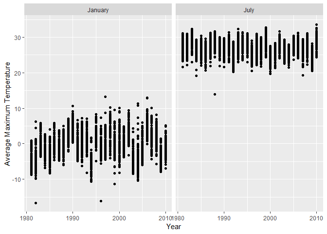
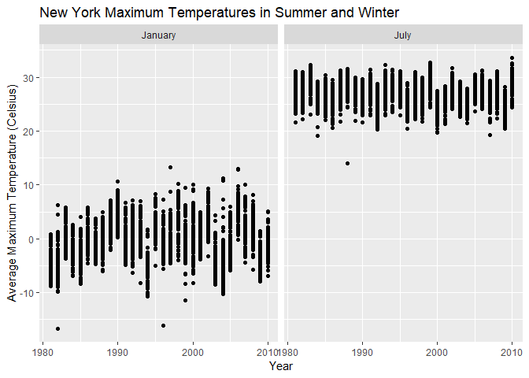
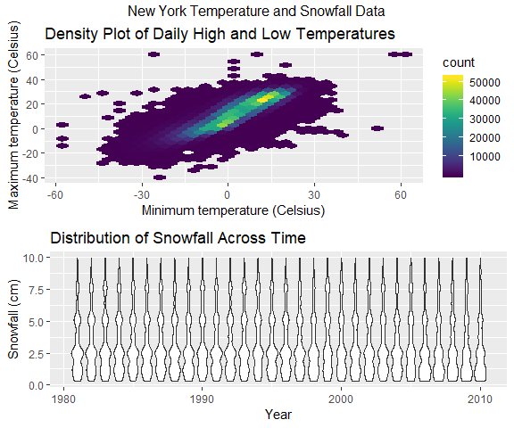

p8105\_hw3\_rt2712
================
Rachel Tsong
15 October 2018

Problem 1
=========

Step 1
------

Load and clean up the BRFSS data

``` r
library(tidyverse)
```

    ## -- Attaching packages --------------------------------------------------------------------------------- tidyverse 1.2.1 --

    ## v ggplot2 3.0.0     v purrr   0.2.5
    ## v tibble  1.4.2     v dplyr   0.7.6
    ## v tidyr   0.8.1     v stringr 1.3.1
    ## v readr   1.1.1     v forcats 0.3.0

    ## -- Conflicts ------------------------------------------------------------------------------------ tidyverse_conflicts() --
    ## x dplyr::filter() masks stats::filter()
    ## x dplyr::lag()    masks stats::lag()

``` r
library(p8105.datasets)

data(brfss_smart2010)

brfss_data = brfss_smart2010 %>%
  janitor::clean_names() %>%
  filter(topic == "Overall Health") %>%
  rename(state = locationabbr, county = locationdesc, proportion_responses = data_value) %>%
  select(year:county, response, proportion_responses) %>%
  mutate(response = factor(response, levels = c("Poor", "Fair", "Good", "Very good", "Excellent")))
```

Step 2
------

Answer questions

**In 2002, which states were observed at 7 locations?**

``` r
brfss_data %>%
  filter(year == 2002) %>%
  distinct(county, .keep_all = TRUE) %>%
  group_by(state) %>%
  summarize(n = n()) %>%
  filter(n == 7)%>%
  as_tibble()
```

    ## # A tibble: 3 x 2
    ##   state     n
    ##   <chr> <int>
    ## 1 CT        7
    ## 2 FL        7
    ## 3 NC        7

In 2002, there were 3 states that were observed at exactly 7 locations (Connecticut, Florida, and North Carolina).

**“Spaghetti plot” showing the number of locations in each state from 2002 to 2010**

``` r
library(ggplot2)

brfss_data %>%
  group_by(year, state) %>%
  summarize(n_counties = n_distinct(county)) %>%
  ggplot(aes(x = year, y = n_counties, color = state)) + 
  labs(x = "Year", y = "Number of Counties", color = "State") +
  geom_line(size = 1)
```


The spaghetti plot above shows the number of different counties that were surveyed by the BRFSS from 2002 to 2010 in each state. Since all 50 states and DC are representd in the data set, it is hard to distinguish between the different states in the plot by color. However, there I couldn't really figure out a better way to distinguish between the states, the figure is not necessarily a good figure to draw conclusions from.

**Mean and standard deviation of the proportion of “Excellent” responses across locations in NY State (2002, 2006, and 2010)**

``` r
brfss_data %>%
  filter(state == "NY", response == "Excellent", year == 2002 | year == 2006 | year == 2010) %>%
  group_by(year) %>%
  summarize(mean_excellent = mean(proportion_responses), sd_excellent = sd(proportion_responses)) %>%
  knitr::kable(digits = 1)
```

|  year|  mean\_excellent|  sd\_excellent|
|-----:|----------------:|--------------:|
|  2002|             24.0|            4.5|
|  2006|             22.5|            4.0|
|  2010|             22.7|            3.6|

From the summary table above, it appears as if the mean number of respondents who consider themselves to be in "Excellent" health was about the same in 2002, 2006, and 2010 (about 22-24% of respondents). Looking at the standard deviations, it appears as if there was the highest variation in the proportion of excellent responses by county in NY in 2002 and the lowest variation in 2010.

**Five-panel plot showing the distribution of state-level averages over time for each response category**

``` r
brfss_data %>%
  group_by(year, state, response) %>%
  summarize(mean = mean(proportion_responses)) %>% 
  ggplot(aes(x = year, y = mean)) + 
    geom_point() + 
    facet_grid(~response) +
    labs(x = "Year", y = "Average Proportion of Responses", title = "Average Proportion of Responses Over Time") +
    theme(axis.text.x = element_text(angle = 90))
```

    ## Warning: Removed 21 rows containing missing values (geom_point).


In this 5 panel plot, we can see how the proportion of responses for each state varies across time. Also, since I plotted a point for each state, we can get an idea of how varied the data are within each category.

Problem 2
=========

Step 1
------

``` r
data("instacart")
```

**Dataset description**
This dataset contains information about customer orders from Instacart, a grocery delivery company. First, there is some information about the customer including the customer ID, days since last Instacart order, number of times they've ordered from Instacart, and the day and time the customer placed the order. The day is only given as the day of the week numbered from 0 to 6, and I assumed 0 was Sunday, though this is unclear. The time ordered is given as a single value, which I assume to be hours since midnight (e.g. "13" means 1:00 pm). An interesting variable is the "reordered" column. This column in the dataset is characterized as an integer vector, but since it only takes on values of 0 and 1, I am thinking it is most likely a logical vector indicating whether or not the customer has ordered that same item in a previous order. Additionally, there is information about the contents of the order including the product name and where the product can be found in the store (department and aisle). For example, the product "Bulgarian yogurt" is identified by a numerical product ID, and it is in the "yogurt" aisle in the "dairy & eggs" department. The aisle and deparment is also identified by a numerical ID. There are 1,384,617 observations of 15 variables.

Step 2
------

Answer questions

**How many aisles are there, and which aisles are the most items ordered from**

``` r
instacart %>% 
  group_by(aisle) %>%
  summarize(n = n()) %>%
  arrange(-n) %>%
  head() %>%
  knitr::kable()
```

| aisle                         |       n|
|:------------------------------|-------:|
| fresh vegetables              |  150609|
| fresh fruits                  |  150473|
| packaged vegetables fruits    |   78493|
| yogurt                        |   55240|
| packaged cheese               |   41699|
| water seltzer sparkling water |   36617|

There are 134 aisles, and the most ordered from aisles are shown in the table above.

**Plot showing the number of items ordered in each aisle**

``` r
instacart %>%
  group_by(department, aisle, aisle_id) %>%
  filter(aisle != "missing") %>%
  summarize(n = n()) %>%
  ungroup() %>%
  mutate(aisle = factor(aisle, levels = aisle[order(n)])) %>%
  ggplot(aes(x = aisle, y = n, color = department, fill = department)) +
  geom_bar(stat = "identity", width = 0.5) + 
  coord_flip() +
  theme(axis.text.y = element_text(size = rel(0.6)), legend.position = "bottom" ) +
  labs(x = "Number of Orders", y = "Aisle", title = "Number of Orders on Instacart by Aisle")
```


In the plot above, I chose to order the aisle by the number of orders. Because there are 134 aisles, it was a challenge figuring how best to display all of the aisles in a readable way. One option that would have increased readability was to display the aisles by their ID number, but since this would require one to reference another data set in order to know which aisle matched which ID, I really wanted to display the aisle names. Flipping the coordinate axes helped with this problem. Additionally, I chose to use colors to display the department each aisle belonged to so that the figure shows more information - for example, it is interesting to note that the top 3 most ordered from aisles are all from the produce department.

**Most popular item in “baking ingredients”, “dog food care”, and “packaged vegetables fruits”**

``` r
instacart %>% 
  group_by(aisle, product_name) %>%
  filter(aisle == "baking ingredients" | aisle == "dog food care" | aisle == "packaged vegetables fruits") %>%
  summarize(n = n()) %>%
  filter(n == max(n)) %>%
  knitr::kable()
```

| aisle                      | product\_name                                 |     n|
|:---------------------------|:----------------------------------------------|-----:|
| baking ingredients         | Light Brown Sugar                             |   499|
| dog food care              | Snack Sticks Chicken & Rice Recipe Dog Treats |    30|
| packaged vegetables fruits | Organic Baby Spinach                          |  9784|

The most popular items from each aisle are listed above. "Packaged vegetable fruits" is one of the most ordered from aisles, so it is unsurprising that the most ordered item within that aisle is ordered much more often than the most ordered items in the other two aisles.

**Table showing the mean hour of the day at which Pink Lady Apples and Coffee Ice Cream are ordered on each day of the week**

``` r
instacart %>%
  mutate(order_dow = factor(order_dow, 0:6, c("Sunday", "Monday", "Tuesday", "Wednesday", "Thursday", "Friday", "Saturday"))) %>%
  filter(product_name == "Pink Lady Apples" | product_name == "Coffee Ice Cream") %>%
  group_by(order_dow, product_name) %>%
  summarize(mean_hour = mean(order_hour_of_day)) %>%
  spread(key = order_dow, value = mean_hour) %>%
  knitr::kable(digits = 1)
```

| product\_name    |  Sunday|  Monday|  Tuesday|  Wednesday|  Thursday|  Friday|  Saturday|
|:-----------------|-------:|-------:|--------:|----------:|---------:|-------:|---------:|
| Coffee Ice Cream |    13.8|    14.3|     15.4|       15.3|      15.2|    12.3|      13.8|
| Pink Lady Apples |    13.4|    11.4|     11.7|       14.2|      11.6|    12.8|      11.9|

Generally, it seems as is people are buying coffee ice cream and pink lady apples at about the same mean time on Sunday, Wednesday, and Friday. On the other days the mean hour that coffee ice cream is ordered is a couple of hours after the mean hour that pink lady apples are ordered.

Problem 3
=========

Step 1
------

Load NY NOAA data and describe the data set

``` r
data("ny_noaa")

head(ny_noaa)
```

    ## # A tibble: 6 x 7
    ##   id          date        prcp  snow  snwd tmax  tmin 
    ##   <chr>       <date>     <int> <int> <int> <chr> <chr>
    ## 1 US1NYAB0001 2007-11-01    NA    NA    NA <NA>  <NA> 
    ## 2 US1NYAB0001 2007-11-02    NA    NA    NA <NA>  <NA> 
    ## 3 US1NYAB0001 2007-11-03    NA    NA    NA <NA>  <NA> 
    ## 4 US1NYAB0001 2007-11-04    NA    NA    NA <NA>  <NA> 
    ## 5 US1NYAB0001 2007-11-05    NA    NA    NA <NA>  <NA> 
    ## 6 US1NYAB0001 2007-11-06    NA    NA    NA <NA>  <NA>

``` r
sum(is.na(ny_noaa$prcp))
```

    ## [1] 145838

``` r
sum(is.na(ny_noaa$snow))
```

    ## [1] 381221

``` r
sum(is.na(ny_noaa$snwd))
```

    ## [1] 591786

``` r
sum(is.na(ny_noaa$tmax))
```

    ## [1] 1134358

``` r
sum(is.na(ny_noaa$tmin))
```

    ## [1] 1134420

``` r
range(ny_noaa$date)
```

    ## [1] "1981-01-01" "2010-12-31"

``` r
n_distinct(ny_noaa$id)
```

    ## [1] 747

**Description**
This data set contains information about weather in New York from 747 NOAA weather stations from January 1, 1981 to December 31, 2010. Key variables are the high and low temperatures for the day and precipitation information, including cumulative snow depth. Although this data set is quite large with almost 2.6 million observations for 7 variables, there is a lot of missing data. For example, there are about 1.13 million missing observations for maximum and minimum temperature. These missing values restrict what inferences can be drawn from the data set.

Step 2
------

Clean the data and answer questions

**Create separate variables for year, month, and day and ensure observations have reasonable units**

``` r
ny_noaa_tidy = separate(ny_noaa, date, into = c("year", "month", "day"), sep = "-") %>%
  mutate(year = as.numeric(year), 
         month = as.numeric(month), 
         day = as.numeric(day), 
         tmax_degrees = as.numeric(tmax)/10, 
         tmin_degrees = as.numeric(tmin)/10,
         prcp_mm = prcp/10,
         snow_mm = snow/10,
         snwd_mm = snwd/10) %>%
  select(-(prcp:tmin)) 
```

In the code above, I separated the data into columns for year, month, and day and transformed variables into numerical vectors. I spent a lot of time confused about the units for precipitation and temperature, and after Google, as well as some discussion forum insight, it seems as if the units are in tenths of a millimeter for precipitation and tenths of a degree (Celcius) for temperature. While these units might make sense when we are interested in small changes such as rainfall per minute, it does not make sense to report data for an entire day in these units, so I changed the units to millimeters and degrees Celcius

**What are the most commonly observed values for snowfall and why?**

``` r
ny_noaa_tidy %>%
  group_by(snow_mm) %>%
  summarize(n=n()) %>%
  arrange(-n) %>%
  head() %>%
  knitr::kable()
```

|  snow\_mm|        n|
|---------:|--------:|
|       0.0|  2008508|
|        NA|   381221|
|       2.5|    31022|
|       1.3|    23095|
|       5.1|    18274|
|       7.6|    10173|

The most commonly observed values for snowfall are 0 and NA. Obviously, most days in New York experience no snowfall. As previously discussed, the data set contains a large number of missing values; it is unclear whether this is due to neglect or some sort of instrument malfunction.

**Two-panel plot showing the average max temperature in January and July in each station across years**

``` r
ny_noaa_tidy %>%
  filter(month == 1 | month == 7) %>%
  mutate(month = month.name[month]) %>%
  drop_na() %>%
  group_by(month, year, id) %>%
  summarize(mean_tmax = mean(tmax_degrees)) %>% 
  ggplot(aes(x = year, y = mean_tmax)) +
  geom_point() +
  facet_grid(~month) +
  labs(x = "Year", y = "Average Maximum Temperature") 
```



**Is there any observable / interpretable structure? Any outliers?** Looking at these two graphs, there are a couple of interesting features to note. First, the data for January max temperatures within a single year is more spread out than the data for July max temperatures, meaning different stations record more varied temperature data in January and more consistent temperature data in July. From year to year, the variation in January is also greater than the variation in July: July is consistently hot every year, but January has some relatively warmer years and some exceptionally colder years. Regarding outliers, there are more noticable outliers in January. It appears as if 1982 and 1996 have a station recording an exceptionally cold January and 1997 and 2004 have a station that recorded a warmer than average January. In July there is one lucky area in 1988 that recorded a brisk average max temperature in July of 14 degrees - either a very strange year or a faulty temperature gauge.

**Make a two-panel plot showing (i) tmax vs tmin for the full dataset (note that a scatterplot may not be the best option); **

``` r
library(hexbin)
library(viridis)
```

    ## Loading required package: viridisLite

``` r
ny_noaa_tidy %>% 
  drop_na() %>%
  ggplot(aes(x = tmin_degrees, y = tmax_degrees)) +
  geom_hex() +
  scale_fill_viridis()
```



**(ii) make a plot showing the distribution of snowfall values greater than 0 and less than 100 separately by year.**

``` r
ny_noaa_tidy %>%
  drop_na %>%
  filter(snow_mm > 0 & snow_mm < 10) %>%
  ggplot(aes(x = year, y = snow_mm, group = year)) +
  geom_violin()
```


